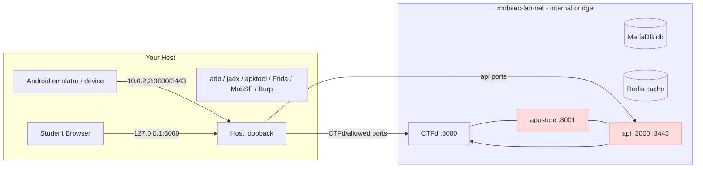

# Architecture

## Overview

The lab is a CTFd challenge platform plus the mobile-lab targets, all on a
**single isolated Podman bridge network** named `mobsec-lab-net`.

The network is declared with `internal: true`, so containers on it **cannot
reach the internet, the host LAN, or each other's host-mapped ports**. Only
CTFd and the api publish host ports, both bound to loopback by default.

The **attacker workstation is the student's host + Android emulator/device**:
`adb`, `jadx`, `apktool`, Frida, MobSF, Burp/mitmproxy all run there. The
emulator reaches the lab's api backend through the alias `10.0.2.2`.



## Services

| Service   | Image (source)                        | Purpose                              | Host ports                 |
|-----------|---------------------------------------|--------------------------------------|----------------------------|
| `ctfd`    | `ghcr.io/ctfd/ctfd:3.7.4`             | Challenge/flag platform              | `127.0.0.1:8000`           |
| `db`      | `mariadb:10.11`                       | CTFd database                        | none                       |
| `cache`   | `redis:7-alpine`                      | CTFd cache/session                   | none                       |
| `store`/`appstore` | build `mobsec-lab/appstore`    | Serves the APK + attachments         | none*                      |
| `api`     | build `mobsec-lab/api`                | Mobile backend (HTTP + pinned HTTPS) | loopback `3000`, `3443`*   |
| `proxy`   | `caddy:2-alpine`                      | Optional single-entry reverse proxy  | none*                      |

> \* When `EXPOSE_TARGETS=1` (overlay `compose.lan.yml`), the `proxy` service
> publishes ONE HTTP port (default `8080`) fronting CTFd + appstore + api via
> `*.sslip.io` hostnames, and `api` re-binds its two ports to `0.0.0.0` for
> LAN devices/emulators.

## The APK as the target

The *real* target students analyze is the vulnerable app:

```
targets/app/  →  (lab.py build-apk)  →  GlowMartMobile.apk  →  appstore → adb install
```

The APK builder (Dockerfile in `targets/app`) runs **outside** the isolated
network because it downloads the Android SDK/NDK. The resulting APK lands in
`targets/appstore/www/apk/` and is served from the isolated `appstore`
service for students.

## Reaching the services from the host/emulator

| Who           | URL                                                          |
|---------------|--------------------------------------------------------------|
| Browser       | `http://127.0.0.1:8000/` (CTFd)                              |
| Emulator HTTP | `http://10.0.2.2:3000/` (api)                                |
| Emulator TLS  | `https://10.0.2.2:3443/` (pinned api, Module 3)              |
| LAN (class)   | `http://ctfd.<IP>.sslip.io:8080/`, `appstore.<IP>...`, `api.<IP>...` |

From inside the network, an attacker container can also reach them by service
name:

```bash
podman run -it --rm --network mobsec-lab-net python:3.11-alpine /bin/sh
# curl http://appstore:8001/apk/GlowMartMobile.apk -o app.apk
```

## Isolation model

| Control | Implementation |
|---------|----------------|
| No internet for targets | Network `internal: true` (no default route) |
| No broad host exposure  | Only `ctfd` (loopback) and `api` (loopback) ports |
| Local-only CTFd access  | Port bound to `127.0.0.1` (configurable in `.env`) |
| Reset                   | `down -v` rebuilds cleanly |

### Verifying isolation

```bash
python scripts/lab.py health
```

Confirm:
- `mobsec-lab-net` shows `internal=true`.
- Only `ctfd` (8000) and `api` (3000/3443) publish host ports, both loopback.
- `appstore` shows **no** host port.

Advanced check — a target should *not* be able to reach the internet:

```bash
podman run --rm --network mobsec-lab-net alpine:3.20 \
  wget -qO- http://example.com --timeout=5 || echo "no internet (expected)"
```

## Caveats

- The committed TLS keypair in `targets/api/certs/` is a lab artifact — never
  reuse it outside the lab.
- `EXPOSE_TARGETS=1` reaches anyone on your LAN — restore isolation with
  `EXPOSE_TARGETS=0` + `python scripts/lab.py close`.